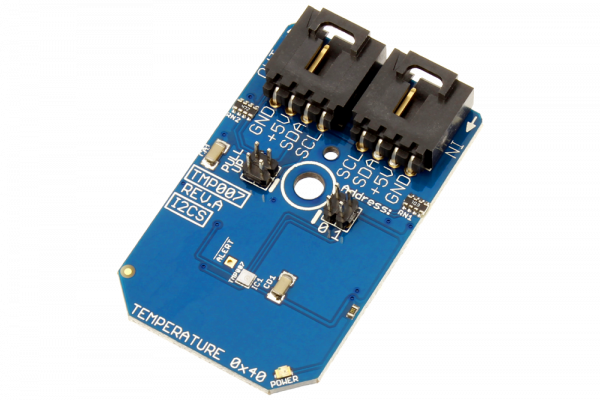

[](https://store.ncd.io/product/tmp007-infrared-thermopile-sensor-with-integrated-math-engine-i2c-mini-module/).

#  TMP007

The Texas Instruments TMP007 is a fully-integrated micro electro-mechanical system (MEMS) thermopile sensor that measures the temperature of an object without direct contact. The integrated thermopile absorbs the infrared energy emitted from the object in the sensor’s field of view. 
This Device is available from www.ncd.io 

[SKU: TMP007]

(https://store.ncd.io/product/tmp007-infrared-thermopile-sensor-with-integrated-math-engine-i2c-mini-module/)
This Sample code can be used with Raspberry Pi.

Hardware needed to interface TMP007 infrared thermopile sensor With Raspberry Pi :
1. <a href="https://store.ncd.io/product/tmp007-infrared-thermopile-sensor-with-integrated-math-engine-i2c-mini-module/">TMP007 infrared thermopile sensor</a>
2.  <a href="https://store.ncd.io/product/i2c-shield-for-raspberry-pi-3-pi2-with-outward-facing-i2c-port-terminates-over-hdmi-port/">Raspberry Pi I2C Shield</a>
3. <a href="https://store.ncd.io/product/i%C2%B2c-cable/">I2C Cable</a>

## Python
Download and install smbus library on Raspberry pi. Steps to install smbus are provided at:

https://pypi.python.org/pypi/smbus-cffi/0.5.1

Download (or git pull) the code in pi. Run the program.

```cpp
$> python TMP007.py
```
The lib is a sample library, you will need to calibrate the sensor according to your application requirement.
